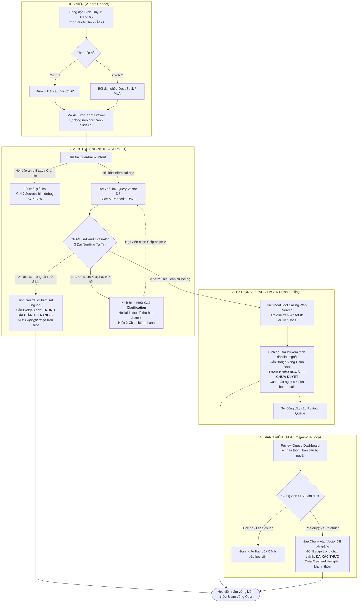

# Sơ Đồ Luồng Hoạt Động (Flowchart & Architecture — Chuẩn Bị CP2)

**Track:** Track A · VLearn Tutor — Đề A1: Tối ưu AI Tutor bám sát bài giảng & Xác thực nguồn 2 tầng  
**Nhóm:** BDKT · **Lớp:** 3B · **Phòng:** E403  
**Bản mẫu tương tác:** `codebase/index.html` (Mô phỏng 100% VLearn Reader + AI Tutor Drawer)  
**Sơ đồ luồng Archify:** `codebase/vlearn-workflow.html` (Được biên dịch chuẩn xác bằng Archify Engine)

---

## 1. Phân vai 4 Tác nhân (4 Actors / Swimlanes)

| Actor / Tác nhân | Vai trò trong hệ thống | Vị trí giao diện tương ứng trên VLearn |
|---|---|---|
| **1. Học viên (Student)** | Người học đọc slide Day 1 (Trang 65), bôi đen khái niệm hoặc bấm `+ Đặt câu hỏi với AI`. Nhận câu trả lời kèm nhãn xác thực hoặc phản hồi khi AI hỏi lại. | Màn hình chính `vlearn.dev/course/k4p1/reader`, Slide Viewer trung tâm & Khung chat Right Drawer. |
| **2. AI Tutor Engine (RAG & Router)** | Tiếp nhận câu hỏi, neo ngữ cảnh Slide 65, kiểm tra Guardrail chống gian lận, thực hiện trích xuất RAG nội bộ và phân loại tự tin qua mô hình 3 Dải Ngưỡng Thích Ứng (CRAG Evaluator). | Backend điều phối ngầm & Right Drawer của VLearn. |
| **3. External Search Agent (Tool Calling)** | Kích hoạt khi RAG nội bộ thiếu căn cứ (< beta). Tra cứu Web theo Whitelist học thuật (arXiv, docs chính thống), sinh câu trả lời kèm Badge Vàng Cảnh Báo (Disclaimer). | Agent phụ trợ, tự động format footnote trích dẫn và đẩy vào Review Queue. |
| **4. Giảng viên / TA (Human Reviewer)** | Giữ quyền kiểm soát (Human-in-the-loop). Đánh giá các câu trả lời ngoài giáo trình trên hàng đợi duyệt, phê duyệt để nạp ngược vào Vector DB (Data Flywheel). | Giao diện quản trị `vlearn.dev/teacher/review` (Review Queue Modal). |

---

## 2. Sơ đồ luồng xử lý (Mermaid Workflow)

---

## 3. Bản đồ 4 Đường đi Trải nghiệm (Rubric R3)

| Đường đi | Tình huống kích hoạt trên Slide 65 | Hành vi của AI Tutor trong Drawer | Vị trí kiểm chứng trên Prototype |
|---|---|---|---|
| **1. Happy Path** *(AI tự tin cao)* | Học viên hỏi: *"Khi nào nên chọn Tầng 2 thay vì Tầng 1 theo quy ước bài học?"* | RAG trích đúng Slide 65, trả lời Tầng 2 là tầng mặc định thử trước cho việc hàng ngày. Gắn Badge Xanh `✅ ĐÃ XÁC THỰC TRONG BÀI GIẢNG · SLIDE TRANG 65`. | Tab 1: "1. Trong bài" |
| **2. Low-Confidence** *(Lớp chỗ khó ②)* | Học viên hỏi ngắn/mơ hồ: *"DeepSeek có dùng được không?"* | AI áp dụng **HAX G10**, không đoán bừa. Hỏi lại: *"Bạn đang muốn hỏi DeepSeek ở khía cạnh Tầng 3 Self-host bảo mật dữ liệu hay so sánh chi phí API với Tầng 2?"* kèm 2 Chips bấm nhanh. | Tab 2: "2. Mơ hồ (G10)" |
| **3. Failure / No-Grounding** *(Lớp chỗ khó ①)* | Học viên hỏi khái niệm nâng cao chưa dạy: *"DeepSeek-V3 dùng kiến trúc Multi-Head Latent Attention (MLA) là gì và có trong bài không?"* | Nhận diện Slide Day 1 không có định nghĩa MLA (< beta). AI gọi tool search trên arXiv, trả lời kèm **Badge Vàng**: `⚠️ THAM KHẢO NGOÀI — CHƯA ĐƯỢC GIẢNG VIÊN XÁC THỰC` và cảnh báo lệch barem thi. Tự động chuyển vào Review Queue. | Tab 3: "3. Ngoài bài" |
| **4. Correction** *(Human-in-the-loop)* | Giảng viên/TA mở modal Review Queue để thẩm định câu trả lời về MLA. | Giảng viên bấm `[✅ Duyệt & Nạp vào Vector DB]`. Tri thức mới được ingest vào Vector DB bài học. Badge trong phiên chat của học viên tự động chuyển sang `🌟 ĐÃ XÁC THỰC BỞI GIẢNG VIÊN`. | Tab 4: "4. TA Duyệt" / Modal TA |

---

## 4. Kiểm chứng file thực tế trong Repository

1. **Giao diện VLearn thật (Ảnh gốc):** `codebase/vlearn_actual_ui.png`
2. **Bản mẫu tương tác (Interactive Clickable Mock):** `codebase/index.html`
3. **Đặc tả sơ đồ luồng Archify:** `codebase/vlearn-tutor.workflow.json`
4. **Sơ đồ luồng trực quan tương tác (Archify Rendered):** `codebase/vlearn-workflow.html`
