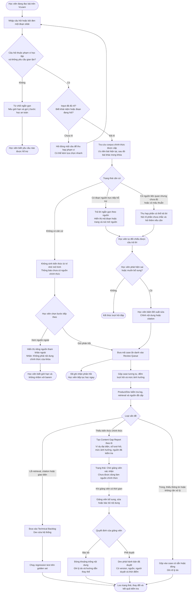

# Luồng Trải Nghiệm VLearn AI Tutor (CP2)

**Track:** A · A1 — Tối ưu AI Tutor hiện có

**Nhóm:** BDKT · Lớp 3B · Phòng E403

**Lát cắt:** Học viên đang học trên VLearn hỏi một khái niệm → Tutor quyết định trả lời có căn cứ, hỏi lại khi mơ hồ hoặc dừng khi thiếu nguồn → học viên biết câu trả lời dựa trên đâu và cần làm gì tiếp theo.

---

## 1. Phạm Vi Bản Mẫu

Đây là **luồng trải nghiệm của AI Tutor**, không phải công cụ chọn mô hình. Slide "Chọn model theo tầng" chỉ là nội dung minh họa để học viên đặt câu hỏi.

| Thành phần | Trạng thái tại CP2 |
|---|---|
| Giao diện VLearn Reader và AI Tutor Drawer | Mock bấm được |
| Trả lời có nguồn, hỏi lại, no-grounding và correction | Dữ liệu giả lập để kiểm tra luồng |
| Truy xuất tài liệu và lời gọi mô hình thật | Chưa bắt buộc tại CP2 |
| Web search, Review Queue và cập nhật kho tri thức | Chỉ mô phỏng, không tuyên bố đã chạy thật |

**Automation:** Conditional. Tutor chỉ tự trả lời khi có đoạn tài liệu trực tiếp hỗ trợ. Khi input mơ hồ, Tutor hỏi lại. Khi không có căn cứ hoặc cần thẩm quyền, Tutor dừng và chuyển người.

**Lý do theo cost-of-error:** Trả lời sai quy ước khóa học có thể khiến học viên học sai và mất điểm. Vì vậy, phản hồi được gửi cho Product/Dev phân loại trước; chỉ khoảng trống kiến thức chính thức mới chuyển giảng viên, còn lỗi retrieval/citation do Dev xử lý.

---

## 2. Bốn Tác Nhân

| Tác nhân | Trách nhiệm |
|---|---|
| **Học viên** | Bôi đen đoạn slide hoặc nhập câu hỏi; kiểm tra nguồn; yêu cầu làm rõ hoặc đề xuất sửa kết quả. |
| **AI Tutor** | Kiểm tra phạm vi và độ đầy đủ của input; tìm căn cứ trong corpus được phép; trả lời, hỏi lại hoặc dừng đúng lúc. |
| **Product/Dev team** | Gộp và phân loại phản hồi; tự xử lý lỗi hệ thống; tổng hợp khoảng trống kiến thức thành báo cáo ngắn cho giảng viên. |
| **Giảng viên / Chủ sở hữu nội dung** | Chỉ xử lý Content Gap Report; bổ sung, sửa, phê duyệt hoặc bác bỏ kiến thức chính thức. |

Review Queue chỉ dùng mã case hoặc mã học viên ẩn danh. Dev chỉ chuyển cho giảng viên phần nội dung tối thiểu cần thẩm định, không chuyển toàn bộ lịch sử học viên.

---

## 3. Sơ Đồ Luồng Chính



### Quy tắc quan trọng

- Cross-lecture là bước tra cứu bên trong happy path, không phải đường trải nghiệm thứ năm.
- "Tìm thấy đoạn liên quan" không đồng nghĩa "đã xác thực hoàn toàn"; mọi citation phải thực sự hỗ trợ claim.
- Không có căn cứ thì không đưa câu trả lời kiến thức chưa duyệt vào khung trả lời chính.
- Nguồn ngoài chỉ là lựa chọn tham khảo tách biệt và luôn có cảnh báo.
- Dev được quyết định cách sửa hệ thống nhưng không được tự quyết định kiến thức chuyên môn chính thức.
- Giảng viên chỉ nhận Content Gap Report đã gộp theo lô, không nhận từng câu hỏi riêng lẻ.
- Content Gap Report ưu tiên nội dung liên quan quiz/barem, nhiều người gặp hoặc có hậu quả cao.
- Case chờ giảng viên không chặn phiên học và không tự động trở thành nguồn chính thức.
- Bản phát hành cần version, nguồn, người duyệt, thời điểm và kết quả regression test.

---

## 4. Bốn Đường Đi Bắt Buộc

| Đường đi | Trigger | Hành vi mong muốn | Kết quả kiểm chứng được |
|---|---|---|---|
| **1. Happy path** | Câu hỏi rõ và có nguồn trực tiếp trong bài hiện tại hoặc bài khác của khóa. | Trả lời theo đúng phần nguồn hỗ trợ, hiện mã đoạn/trang và nút mở nguồn. | Học viên mở được nguồn để tự đối chiếu. |
| **2. Low-confidence** | Câu hỏi mơ hồ, thiếu đối tượng hoặc chỉ có nguồn liên quan nhưng chưa đủ. | Hỏi đúng một câu làm rõ hoặc thu hẹp phần có thể trả lời; không tự đoán. | Học viên cung cấp thêm ngữ cảnh trước khi Tutor trả lời tiếp. |
| **3. Failure / no-grounding** | Không tìm thấy căn cứ trong corpus chính thức hoặc câu hỏi cần dữ liệu/thẩm quyền hệ thống không có. | Dừng trả lời kiến thức; cho xem nguồn ngoài tách biệt hoặc gửi phản hồi. Dev gộp và phân loại trước khi quyết định có cần giảng viên. | Không có claim/citation bị bịa; học viên tiếp tục học ngay. |
| **4. Correction** | Học viên phát hiện nội dung/citation sai hoặc thiếu. | Học viên đề xuất sửa; Dev phân loại thành lỗi hệ thống hoặc khoảng trống kiến thức; chỉ nhánh kiến thức mới gửi giảng viên. | Có owner, trạng thái, bản sửa, nguồn và lịch sử phát hành rõ ràng. |

Nhánh từ chối gian lận là guardrail bổ sung, không thay thế bốn đường đi trên.

---

## 5. HAX / PAIR Áp Dụng

| Nguyên tắc | Áp cụ thể vào đâu trong luồng |
|---|---|
| **HAX G10 — Thu hẹp phạm vi khi nghi ngờ** | Nút `Clear`: input thiếu đối tượng thì hỏi đúng một câu; nút `Evidence`: nguồn chưa đủ thì chỉ trả lời phần được hỗ trợ. |
| **HAX G11 — Giải thích vì sao** | Câu trả lời grounded hiển thị mã đoạn/trang; no-grounding nói rõ không tìm thấy nguồn nào. |
| **HAX G8 — Gạt bỏ dễ dàng** | Học viên có thể đóng Tutor Drawer, bỏ qua nguồn ngoài hoặc không gửi phản hồi. Gửi xong vẫn tiếp tục học ngay. |
| **HAX G9 — Sửa dễ dàng** | Nút `Đề xuất sửa` cho phép chỉnh nội dung/citation; Dev và giảng viên sửa tiếp đúng theo loại vấn đề. |
| **PAIR Feedback & Control** | Dev kiểm soát thay đổi hệ thống; giảng viên kiểm soát nội dung chính thức; mọi quyết định có lịch sử. |

---

## 6. Walkthrough Trên Sơ Đồ CP2

| Tình huống walkthrough | Kết quả phải đi tới trên luồng |
|---|---|
| Hỏi một khái niệm có trong bài | Câu trả lời có nhãn `Có căn cứ trong tài liệu` và citation mở được. |
| Nhập `Nó khác gì?` | Tutor hỏi đối tượng nào đang được so sánh. |
| Hỏi một khái niệm chưa có trong khóa | Tutor báo chưa có nguồn, không tự giải thích; hiện `Gửi phản hồi` và `Xem nguồn ngoài`. Gửi xong hiển thị `Đã ghi nhận`, không bắt học viên chờ. |
| Học viên chọn `Đề xuất sửa` | Case đi tới Product/Dev; lỗi kỹ thuật vào backlog, thiếu kiến thức vào Content Gap Report gửi giảng viên theo lô. |

**Điểm kết thúc đúng:** Học viên biết mức độ căn cứ, mở được nguồn hoặc biết bước tiếp theo. Sản phẩm không cam kết học viên chắc chắn làm đúng quiz.

---

## 7. Artifact Kiểm Chứng

- **Artifact chính để nộp CP2:** sơ đồ Mermaid và bốn walkthrough ngay trong [`flowchart.md`](./flowchart.md).
- Giao diện tham khảo: [`codebase/index.html`](./codebase/index.html). Một số tương tác nâng cao vẫn là mock; khi khác với artifact cũ, luồng trong tài liệu này là thiết kế CP2 đã chốt.
- Repository: <https://github.com/dawnmoriaty/K4-3B-E403-BDKT>

Mở bản mẫu CP2 trực tiếp bằng trình duyệt để xem các kịch bản giả lập. Khi chạy phần AI thật của CP3, dùng:

```powershell
python codebase/server.py
```

Sau đó mở <http://127.0.0.1:8000>.
