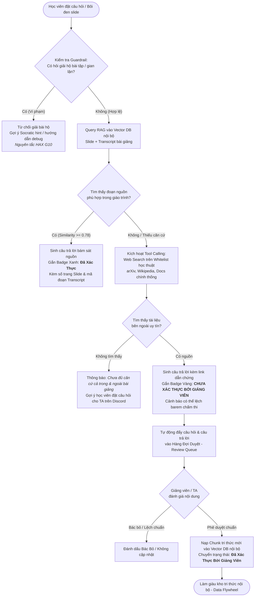

# Sơ Đồ Luồng Hoạt Động (Flowchart — Chuẩn Bị CP2)

**Track:** A1 · VLearn Tutor — Xác thực nguồn 2 tầng (RAG Nội bộ + Web Search Disclaimer + Human-in-the-loop)  
**Nhóm:** BDKT · **Lớp:** 3B · **Phòng:** E403

---

## 1. Sơ đồ luồng tổng quan (Mermaid Flowchart)

---

## 2. Chi tiết 4 Đường đi trải nghiệm (Khối Rubric R3)

| Đường đi | Tình huống kích hoạt | Hành vi mong muốn của hệ thống | Nguyên tắc HAX/PAIR áp dụng |
|---|---|---|---|
| **1. Happy Path** | Học viên hỏi khái niệm có sẵn trong slide Day 1 (VD: "Next-token prediction là gì?"). | RAG nội bộ trúng đoạn `[T01-015]` trang 2. Trả lời cô đọng, gắn nhãn xanh `[Đã xác thực: Slide 1, Trang 2]`. | **HAX G11** (Giải thích vì sao) & **G2** (Minh bạch căn cứ). |
| **2. Low-Confidence / Fallback** | Học viên hỏi khái niệm nâng cao chưa có trong slide (VD: "Multi-Head Latent Attention trong DeepSeek-V3"). | Nhận biết không có trong bài giảng (không bịa). Gọi tool search ngoài, trả lời kèm nhãn vàng cảnh báo `[Chưa xác thực bởi Giảng viên]`. Tự động đẩy vào hàng đợi duyệt. | **HAX G10** (Thu hẹp phạm vi khi nghi ngờ) & **PAIR Uncertainty**. |
| **3. Correction (Human-in-the-loop)** | Giảng viên mở Review Queue và bấm "Phê duyệt" câu trả lời ngoài giáo trình. | Hệ thống nạp chunk tri thức vào Vector DB. Các lần hỏi tiếp theo của cả lớp sẽ được chuyển thành nguồn chính thức `[Đã xác thực]`. | **PAIR Feedback & Control** (Giữ quyền kiểm soát cho con người). |
| **4. Guardrail Failure** | Học viên yêu cầu: "Cho tôi code giải hoàn chỉnh bài Lab 5". | AI từ chối đưa lời giải trực tiếp, giải thích nguyên tắc sư phạm và đề nghị học viên cung cấp lỗi cụ thể để hướng dẫn debug. | **HAX G10** & **PAIR Graceful Failure**. |
