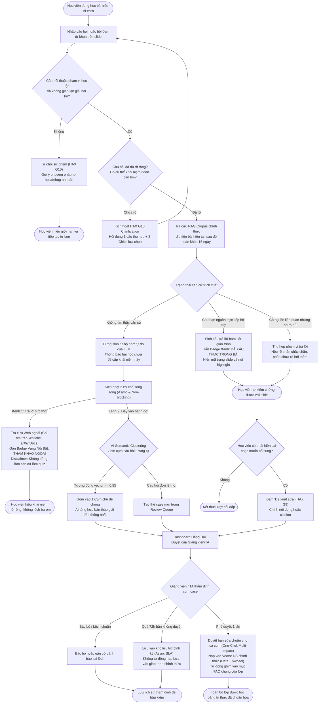

# Luồng Trải Nghiệm & Kiến Trúc VLearn AI Tutor (CP2)

**Khóa học:** VinUni AI20k · Mini Hackathon AI (Batch 04 · Lớp 3B · Phòng E403)  
**Nhóm dự thi:** BDKT (Đội trưởng: Phùng Đức Đăng - 2A202602956)  
**Track:** A · A1 — Tối ưu AI Tutor bám sát bài giảng & Cơ chế xác thực nguồn 2 tầng (RAG nội bộ + Web Search có Disclaimer & Human-in-the-loop).  
**Lát cắt một câu:** Học viên đang học trên VLearn hỏi/bôi đen một khái niệm → Tutor đối chiếu RAG phân cấp (ưu tiên bài hiện tại → mở rộng toàn khóa), tự tin cao thì trả lời có căn cứ trích dẫn số trang, mơ hồ thì hỏi lại (HAX G10), không có căn cứ thì dừng, trả lời ngoài có cảnh báo vàng và gom cụm vào hàng đợi cho Giảng viên duyệt.

---

## 📌 LƯU Ý QUAN TRỌNG DÀNH CHO NGƯỜI ĐỌC (NON-TECH CLARIFICATION)

> [!IMPORTANT]
> **ĐÂY LÀ HỆ THỐNG GIA SƯ AI TRỢ GIẢNG (AI TUTOR), KHÔNG PHẢI LÀ CÔNG CỤ CHỌN MÔ HÌNH!**
>
> 1. **Vấn đề thực tế của học viên:** Khi tự học bài giảng trên nền tảng VLearn, học viên thường gặp các **từ khóa chuyên môn khó hiểu hoặc khái niệm mới** mà tài liệu slide chỉ tóm tắt ngắn gọn.
> 2. **Hành vi bôi đen từ khóa để hỏi bài:** Thay vì copy từ khóa ra ngoài Google (vừa tốn 10–15 phút, vừa dễ đọc tài liệu trôi nổi gây lệch barem chấm thi), học viên chỉ cần:
>    * **Bôi đen trực tiếp từ khóa khó ngay trên trang slide** (hoặc bấm nút `+ Đặt câu hỏi với AI` trên thanh công cụ).
> 3. **AI Tutor giải quyết thế nào:** Trợ lý AI mở khung trò chuyện ở góc phải màn hình, tự động nhận diện học viên đang hỏi về từ khóa ở trang slide nào để giải thích cặn kẽ bám sát giáo trình, trích dẫn đúng số trang và mã bài giảng để học viên ôn thi chính xác nhất.
> *(Slide trang 65 "Chọn model theo TẦNG" được dùng trong tài liệu này là **ví dụ minh họa thực tế** của bài học Day 1 trên VLearn, không phải bản thân sản phẩm là bộ chọn mô hình).*

---

## 1. Phạm Vi Bản Mẫu & Quyết Định Tự Động Hóa

| Thành phần | Trạng thái tại CP2 |
|---|---|
| Giao diện VLearn Reader & AI Tutor Drawer | Bản mẫu bấm được (Clickable Mock Pixel-Perfect) |
| Trả lời có nguồn, hỏi lại, no-grounding & correction | Dữ liệu kịch bản mô phỏng để kiểm tra luồng |
| RAG phân cấp, kiểm tra ý định & lời gọi AI thật | Đã tích hợp qua `codebase/server.py` sẵn sàng cho CP3 |
| Web Search Whitelist & Hàng đợi duyệt của Giảng viên | Có giao diện mô phỏng luồng hoàn chỉnh |

* **Mức tự động hóa (Automation):** **Conditional**. Tutor chỉ tự động trả lời khi có đoạn tài liệu trực tiếp hỗ trợ (>= &alpha;). Khi input mơ hồ ([&beta;, &alpha;)), Tutor kích hoạt HAX G10 hỏi lại. Khi thiếu căn cứ (< &beta;), Tutor dừng sinh kiến thức tự do, chuyển sang nguồn ngoài có cảnh báo và đưa vào hàng đợi thẩm định của Giảng viên.
* **Lý do theo chi phí sai sót (Cost-of-Error):** Trả lời sai quy ước môn học có thể khiến học viên hiểu sai bản chất, mất điểm quiz tự động; chi phí sửa đắt hơn việc chờ một câu hỏi làm rõ hoặc chờ TA duyệt. Vì vậy, nguồn ngoài không bao giờ được tự động biến thành tri thức chính thức nếu chưa có con người duyệt.

---

## 2. Ba Tác Nhân & Phân Quyền (Actors & Governance)

| Tác nhân | Trách nhiệm | Vị trí giao diện tương ứng |
|---|---|---|
| **1. Học viên (Student)** | Bôi đen đoạn slide hoặc nhập câu hỏi; kiểm tra nguồn trích dẫn; chọn chip làm rõ khi AI hỏi lại; đề xuất sửa khi phát hiện sai. | Giao diện chính `vlearn.dev/course/k4p1/reader`, Trình đọc slide và AI Tutor Drawer bên phải. |
| **2. AI Tutor Engine** | Neo ngữ cảnh slide học viên đang xem; kiểm tra Guardrail chống gian lận; đối chiếu RAG phân cấp (Bài hiện tại → Toàn khóa); phân loại tự tin 3 dải (CRAG); gom cụm semantic các câu hỏi tương tự. | Khung trò chuyện Drawer & Bộ điều phối backend. |
| **3. Giảng viên / Trợ giảng (TA)** | Nhận thông báo cụm câu hỏi chưa có nguồn; thẩm định, chỉnh sửa trực tiếp và bấm duyệt nạp vào kho tri thức chung; lưu lịch sử xử lý. | Giao diện quản trị duyệt bài `vlearn.dev/teacher/review`. |

> *Nguyên tắc bảo mật:* Hàng đợi thẩm định chỉ dùng mã case hoặc mã học viên ẩn danh. Không hiển thị thông tin định danh cá nhân nhạy cảm.

---

## 🧭 3. Sơ Đồ Luồng Xử Lý Phân Cấp (Archify Workflow Diagram)

Sơ đồ quy trình xử lý 2 tầng nguồn (RAG nội bộ → Tra cứu ngoài có Disclaimer → Cổng thẩm định Giảng viên) phân theo làn trách nhiệm:


---

## 🔀 4. Sơ Đồ Luồng Logic Chi Tiết (Mermaid Flowchart)



### Quy tắc logic quan trọng
1. **Cross-lecture là bước tra cứu bên trong Happy Path:** Không tạo thành một đường trải nghiệm thứ năm riêng biệt. Khi RAG bài hiện tại không thấy, hệ thống tự động mở rộng sang toàn bộ 15 buổi của khóa học trước khi quyết định ra ngoài web.
2. **Không bịa nguồn:** Tuyệt đối không sinh kiến thức từ trí nhớ tự do của LLM vào khung trả lời chính thức khi không có trích dẫn tài liệu khóa học.
3. **Nguồn ngoài luôn bị cách ly thị giác:** Badge Vàng và Disclaimer cảnh báo lệch barem là bắt buộc.
4. **Audit Trail đầy đủ:** Mọi cập nhật Vector DB phải có ID người duyệt, nội dung đã chỉnh sửa, nguồn và thời điểm phê duyệt.

---

## 🧪 6. Bốn Đường Đi Trải Nghiệm Bắt Buộc (Khối Rubric R3)

| Đường đi | Trigger & Tình huống thực tế | Hành vi mong muốn của AI Tutor | Vị trí kiểm chứng trên Prototype |
|---|---|---|---|
| **1. Happy path** | Học viên hỏi khái niệm có nguồn trực tiếp trong bài (VD Slide 65: *"Khi nào nên chọn Tầng 2 thay vì Tầng 1?"*) hoặc bài khác trong khóa (*"Khái niệm này liên quan gì đến Next-Token Prediction ở Day 1?"*). | Trả lời cô đọng theo đúng phần nguồn hỗ trợ; gắn Badge Xanh: `✅ ĐÃ XÁC THỰC TRONG BÀI GIẢNG · SLIDE TRANG 65` kèm nút bấm highlight vùng trên slide (hoặc nút chuyển sang Slide Day 01). | Tab 1: **"1. Trong bài"** & Tab 5: **"5. Bài khác"** |
| **2. Low-confidence** | Học viên hỏi câu ngắn, thiếu ngữ cảnh (VD: *"DeepSeek có dùng được không?"*). | Kích hoạt **HAX G10**, không tự đoán mò: *"DeepSeek xuất hiện ở cả mục Self-host bảo mật và thảo luận API ngoài bài giảng. Để đối chiếu chuẩn nhất với Slide trang 65, bạn đang muốn hỏi về khía cạnh nào?"* kèm 2 Chips lựa chọn nhanh. | Tab 2: **"2. Mơ hồ (G10)"** |
| **3. Failure / no-grounding** | Học viên hỏi khái niệm nâng cao chưa dạy trong toàn khóa (VD: *"Kiến trúc Multi-Head Latent Attention - MLA của DeepSeek-V3 là gì?"*). | Dừng sinh tri thức chính thức. Kích hoạt Web Search trên Whitelist học thuật, trả lời kèm **Badge Vàng Nổi Bật** và Disclaimer: `⚠️ THAM KHẢO NGOÀI — CHƯA ĐƯỢC GIẢNG VIÊN XÁC THỰC (Có thể lệch barem làm Quiz)`. Tự động đẩy vào Review Queue. | Tab 3: **"3. Ngoài bài"** |
| **4. Correction** | Học viên bấm `[Đề xuất sửa]` khi phát hiện nội dung chưa chuẩn, hoặc Giảng viên/TA mở Hàng đợi duyệt. | Giảng viên/TA đọc bản tóm tắt cụm câu hỏi của AI, chỉnh sửa trực tiếp nội dung/citation rồi bấm `[✅ Phê duyệt & Nạp vào Vector DB]`. Tri thức mới được nạp vào kho dữ liệu chung (Data Flywheel). | Tab 4: **"4. TA Duyệt"** / Nút chế độ Giảng viên |

*Ghi chú:* Nhánh từ chối giải hộ bài Lab (Guardrail chống gian lận) là hàng rào liêm chính học thuật bổ trợ, không thay thế 4 đường đi trên.

---

## 🛡️ 6. Nguyên Tắc Thiết Kế HAX / PAIR Đã Áp Dụng

| Nguyên tắc | Áp cụ thể vào đâu trong sản phẩm |
|---|---|
| **HAX G10 — Thu hẹp phạm vi khi nghi ngờ** | Khi input mơ hồ, AI không đoán bừa mà hiển thị câu hỏi gạn lọc kèm 2 lựa chọn nhanh (Chips); từ chối giải hộ bài thi/lab dứt khoát. |
| **HAX G11 — Giải thích vì sao** | Câu trả lời trong bài hiển thị rõ số trang và nút highlight slide; câu trả lời ngoài bài nêu rõ link nguồn gốc và lý do giáo trình chưa đề cập. |
| **HAX G8 — Gạt bỏ dễ dàng** | Nút `✕` trên góc phải Drawer cho phép học viên thu gọn khung chat ngay lập tức; nút đóng Disclaimer cảnh báo để tập trung đọc. |
| **HAX G9 — Sửa dễ dàng** | Học viên có thể click vào câu gợi ý trên slide để đổi prompt tức thì; nút `[Đề xuất sửa]` cho phép góp ý câu trả lời; TA có ô chỉnh sửa trực tiếp trước khi duyệt. |
| **PAIR Feedback & Control** | Giữ quyền kiểm soát tuyệt đối cho con người qua giao diện Teacher Review Queue, biến tri thức ngoài thành nguồn chuẩn chính thức. |

---

## 🧠 7. Phản Biện Chuyên Sâu 2 Bài Toán Thực Tế Hóc Búa

### Bài toán 1: "Nếu Giảng viên quá bận không confirm thì sao?" (The Bottleneck Problem)

* **Thực tế:** Trong các lớp học quy mô lớn (200+ học viên), Giảng viên và Trợ giảng thường xuyên bị quá tải trong giờ dạy hoặc giờ chấm bài, không thể ngồi trực 24/7 để duyệt câu hỏi của AI. Nếu thiết kế coi việc duyệt của giảng viên là một bước chặn đồng bộ (Synchronous Blocker), hệ thống sẽ bị tê liệt hoàn toàn.
* **Giải pháp thiết kế kiến trúc của nhóm (Async SLA & Visual Isolation):**
  1. **Không chặn học viên (Non-blocking User Flow):** Học viên **không phải chờ** giảng viên duyệt mới nhận được câu trả lời. Hệ thống trả lời ngay lập tức bằng nguồn tra cứu Web Whitelist (arXiv, Docs chính thống), nhưng **cách ly thị giác hoàn toàn** bằng Badge Vàng và Disclaimer cảnh báo rõ ràng. Học viên hiểu được khái niệm mở rộng ngay lúc cần nhưng ý thức được việc không dùng câu này làm căn cứ cãi điểm quiz.
  2. **Vòng đời trạng thái tri thức (Knowledge Lifecycle States):**
     * `Pending Review`: Nằm riêng trong phiên chat của học viên đó, **tuyệt đối không tự động nạp vào Vector DB chung của lớp**.
     * `Stale / Auto-Archive` sau 72h: Nếu sau 72h Giảng viên chưa kịp duyệt, câu hỏi tự động chuyển vào kho lưu trữ định kỳ (Archived Backlog) để rà soát cuối kỳ, bảo toàn 100% tính toàn vẹn của dữ liệu lớp học.
     * `Peer Upvote Escalation`: Nếu nhiều học viên cùng bấm `[Tôi cũng thắc mắc điều này]`, độ ưu tiên của case sẽ tự động tăng lên mức `High Priority` và gửi một thông báo digest duy nhất vào cuối ngày cho TA (tránh spam thông báo gây Alert Fatigue).

---

### Bài toán 2: "Nếu có nhiều câu hỏi tương tự, AI có tổng hợp lại được không?" (Semantic Clustering & Batch Synthesis)

* **Thực tế:** Khi một chủ đề mới xuất hiện (ví dụ: *"Kiến trúc MLA của DeepSeek-V3 hoạt động ra sao?"* hoặc *"Tại sao bài 1 lại chọn Tầng 2 mà không chọn Tầng 1?"*), thường sẽ có 30–50 bạn cùng hỏi các câu tương tự nhau. Nếu giảng viên phải đọc và duyệt 50 lần cho cùng 1 câu hỏi, tính năng Human-in-the-loop sẽ bị người dùng tẩy chay vì quá phiền toái.
* **Giải pháp kỹ thuật của nhóm (AI-Driven Semantic Clustering):**
  1. **Gom cụm tự động bằng Cosine Similarity:**
     * Khi câu hỏi ngoài bài rơi vào Review Queue, hệ thống trích xuất vector embedding và tính độ tương đồng ngữ nghĩa:
       $$\text{Cosine Similarity}(E(q_i), E(q_j)) \ge 0.85$$
     * Tự động gom các câu hỏi trùng lặp thành **1 Cụm chủ đề duy nhất (Topic Cluster)**, ví dụ: `[Cụm #08: Cơ chế Multi-Head Latent Attention (MLA)] — 42 học viên cùng hỏi`.
  2. **AI Consolidated Synthesis (AI soạn sẵn 1 bản thảo duy nhất):**
     * AI đóng vai trò thư ký: Đọc toàn bộ 42 biến thể câu hỏi của học viên, tổng hợp các khía cạnh thắc mắc và soạn sẵn **1 câu trả lời chuẩn duy nhất** bám sát quy ước môn học.
  3. **Cơ chế Duyệt một lần — Cứu cả lớp (One-Click Multi-Impact):**
     * Giảng viên mở Dashboard chỉ nhìn thấy **1 thẻ Cụm** thay vì 42 thông báo rác.
     * Giảng viên đọc bản thảo AI soạn sẵn, tinh chỉnh lại 1-2 câu chữ cho đúng barem lớp, rồi bấm `[✅ Phê duyệt & Ban hành toàn lớp]`.
     * **Kết quả:**
       * Toàn bộ 42 học viên đã hỏi đều nhận được thông báo câu trả lời chính thức từ Giảng viên.
       * Câu trả lời chuẩn được nạp vào Vector DB nội bộ và tự động tạo thành một thẻ **FAQ Khóa học** cho toàn bộ học viên còn lại.
       * **Giảm 95% công sức cho Giảng viên**, biến rủi ro quá tải thành đòn bẩy làm giàu kho tri thức (Data Flywheel).

---

## 💻 8. Tham Chiếu Mã Nguồn & Hướng Dẫn Cách Mở Xem

Toàn bộ mã nguồn giao diện, sơ đồ tương tác và dữ liệu đã được lưu trữ trong thư mục `codebase/`:

```
codebase/
 ├── index.html                  # Bản mẫu tương tác (Interactive Clickable Prototype - 5 kịch bản + Modal TA)
 ├── vlearn-workflow.html        # Sơ đồ luồng tương tác sinh bởi Archify Engine (100% tiếng Việt)
 ├── vlearn-tutor.workflow.json  # File đặc tả cấu trúc sơ đồ theo chuẩn Archify Schema v2
 ├── vlearn-workflow.png         # Ảnh xuất chất lượng cao của sơ đồ luồng Archify (Độ nét cao 2x)
 ├── vlearn-workflow.svg         # File vector SVG nguyên gốc đã nhúng Style CSS độc lập
 ├── server.py                   # API Backend chạy AI thật cho CP3
 └── course_context.json         # Cơ sở dữ liệu ngữ cảnh giáo trình 15 buổi học
```

### 🚀 Cách mở và trải nghiệm:

#### Cách 1: Mở Bản Mẫu Tương Tác VLearn (`codebase/index.html`)
* **Cách mở trực tiếp:** Nhấp đúp chuột vào file [codebase/index.html](./codebase/index.html) hoặc kéo thả file vào trình duyệt web.
* **Đường dẫn local:** `file:///mnt/win_d/VinUni/Hackathon/K4-3B-E403-BDKT/codebase/index.html`
* **Trải nghiệm trên giao diện:**
  * Bấm nút `+ Đặt câu hỏi với AI` hoặc icon AI trên slide để đóng/mở AI Tutor Right Drawer.
  * Bấm thử qua 5 tabs kịch bản: `1. Trong bài`, `2. Mơ hồ (G10)`, `3. Ngoài bài`, `4. TA Duyệt`, `5. Bài khác (Cross-Day)`.
  * Bấm nút `Giảng viên/TA` trên thanh Topbar để mở Hàng đợi thẩm định và thử tính năng bấm Duyệt & Nạp tri thức.

#### Cách 2: Mở Sơ Đồ Luồng Tương Tác Archify (`codebase/vlearn-workflow.html`)
* **Cách mở:** Mở file [codebase/vlearn-workflow.html](./codebase/vlearn-workflow.html) trên trình duyệt:
  `file:///mnt/win_d/VinUni/Hackathon/K4-3B-E403-BDKT/codebase/vlearn-workflow.html`
* **Tính năng tương tác:** Hỗ trợ chuyển đổi Sáng/Tối, xem tiêu điểm từng kịch bản trải nghiệm, bật chế độ Live trace chuyển động luồng dữ liệu.

#### Cách 3: Chạy Backend AI Thật (Sẵn sàng cho CP3)
```bash
python3 codebase/server.py
```
Sau đó mở trình duyệt truy cập: `http://127.0.0.1:8000`.

---

### 🔗 Liên kết kiểm chứng mã nguồn trực tuyến (GitHub):
* **Repository:** [https://github.com/dawnmoriaty/K4-3B-E403-BDKT](https://github.com/dawnmoriaty/K4-3B-E403-BDKT)
* **File Flowchart:** [https://github.com/dawnmoriaty/K4-3B-E403-BDKT/blob/main/flowchart.md](https://github.com/dawnmoriaty/K4-3B-E403-BDKT/blob/main/flowchart.md)
