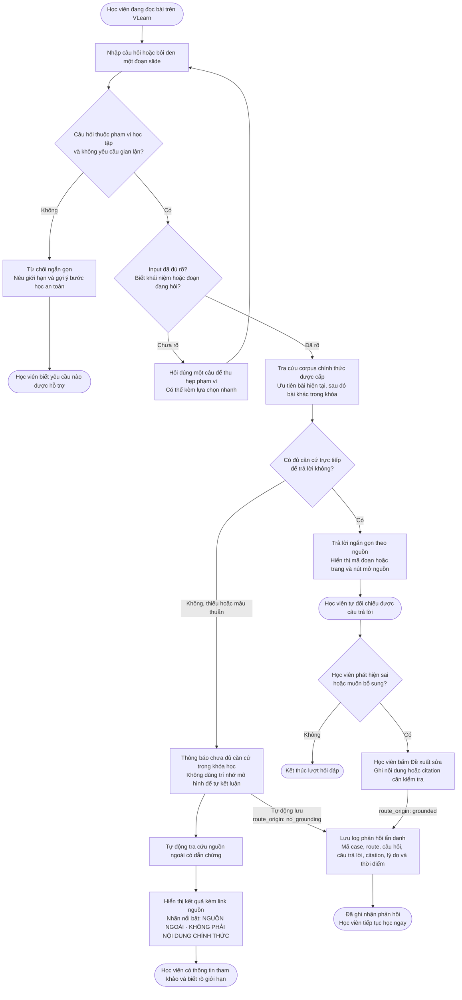

# Luồng Trải Nghiệm VLearn AI Tutor (CP2)

**Track:** A · A1 — Tối ưu AI Tutor hiện có

**Nhóm:** BDKT · Lớp 3B · Phòng E403

**Lát cắt:** Học viên đang học trên VLearn hỏi một khái niệm → Tutor quyết định trả lời có căn cứ, hỏi lại khi mơ hồ hoặc dừng khi thiếu nguồn → học viên biết câu trả lời dựa trên đâu và cần làm gì tiếp theo.

---

## 1. Phạm Vi Bản Mẫu

Đây là **luồng trải nghiệm của AI Tutor**, không phải công cụ chọn mô hình. Slide "Chọn model theo tầng" chỉ là nội dung minh họa để học viên đặt câu hỏi.

| Thành phần | Trạng thái tại CP2 |
|---|---|
| Giao diện VLearn Reader và AI Tutor Drawer | Mock bấm được |
| Trả lời có nguồn, hỏi lại, no-grounding và correction | Dữ liệu giả lập để kiểm tra luồng |
| Truy xuất tài liệu và lời gọi mô hình thật | Chưa bắt buộc tại CP2 |
| Nguồn ngoài, gửi phản hồi và lưu log theo nhánh | Chỉ mô phỏng, không tuyên bố đã chạy thật |

**Automation:** Conditional. Tutor chỉ tự trả lời khi có đoạn tài liệu trực tiếp hỗ trợ. Khi input mơ hồ, Tutor hỏi lại. Khi không có căn cứ hoặc cần thẩm quyền, Tutor dừng và chuyển người.

**Lý do theo cost-of-error:** Trả lời sai quy ước khóa học có thể khiến học viên học sai và mất điểm. Vì vậy, hệ thống không kết luận khi thiếu căn cứ và luôn lưu phản hồi kèm nhánh phát sinh để Dev có dữ liệu kiểm tra sau.

---

## 2. Ba Tác Nhân

| Tác nhân | Trách nhiệm |
|---|---|
| **Học viên** | Bôi đen đoạn slide hoặc nhập câu hỏi; kiểm tra nguồn; yêu cầu làm rõ hoặc đề xuất sửa kết quả. |
| **AI Tutor** | Kiểm tra phạm vi và độ đầy đủ của input; tìm căn cứ trong corpus được phép; trả lời, hỏi lại hoặc dừng đúng lúc. |
| **Dev team** | Nhận log phản hồi ẩn danh có ghi rõ phản hồi đến từ nhánh `grounded` hay `no_grounding`; quy trình xử lý nội bộ nằm ngoài flow CP2. |

Log chỉ dùng mã case hoặc mã học viên ẩn danh, không lưu thông tin định danh trực tiếp.

---

## 3. Sơ Đồ Luồng Chính



### Quy tắc quan trọng

- Cross-lecture là bước tra cứu bên trong happy path, không phải đường trải nghiệm thứ năm.
- "Tìm thấy đoạn liên quan" không đồng nghĩa "đã xác thực hoàn toàn"; mọi citation phải thực sự hỗ trợ claim.
- Không có căn cứ nội bộ thì hệ thống tự động tra cứu nguồn ngoài, nhưng kết quả phải nằm trong khối tham khảo tách biệt và có nhãn cảnh báo nổi bật.
- Nhánh nguồn ngoài đồng thời tự động lưu log `route_origin=no_grounding`; học viên không phải chọn hoặc bấm gửi thêm.
- Mọi phản hồi lưu chung một schema nhưng bắt buộc có `route_origin`: `grounded` hoặc `no_grounding`.
- Log tối thiểu gồm mã case, route, câu hỏi, output AI, citation, loại/lý do phản hồi và thời điểm; không chứa API key hay danh tính trực tiếp.
- Quy trình Dev phân tích, sửa hệ thống hoặc xin xác nhận nội dung diễn ra sau khi nhận log và nằm ngoài phạm vi trải nghiệm CP2.

---

## 4. Bốn Đường Đi Bắt Buộc

| Đường đi | Trigger | Hành vi mong muốn | Kết quả kiểm chứng được |
|---|---|---|---|
| **1. Happy path** | Câu hỏi rõ và có nguồn trực tiếp trong bài hiện tại hoặc bài khác của khóa. | Trả lời theo đúng phần nguồn hỗ trợ, hiện mã đoạn/trang và nút mở nguồn. | Học viên mở được nguồn để tự đối chiếu. |
| **2. Low-confidence** | Câu hỏi mơ hồ hoặc thiếu đối tượng cần giải thích. | Hỏi đúng một câu làm rõ; không tự đoán chủ đề hoặc ý định. | Học viên cung cấp thêm ngữ cảnh trước khi Tutor trả lời tiếp. |
| **3. Failure / no-grounding** | Không tìm thấy căn cứ trong corpus chính thức hoặc nguồn nội bộ mâu thuẫn. | Thông báo thiếu căn cứ; tự động tra cứu và hiển thị nguồn ngoài với nhãn không chính thức; đồng thời tự động lưu log `route_origin=no_grounding`. | Học viên thấy rõ đâu là nguồn ngoài; Dev nhận được log mà không cần học viên thao tác thêm. |
| **4. Correction** | Học viên phát hiện câu trả lời hoặc citation có căn cứ nhưng sai/thiếu. | Học viên bấm `Đề xuất sửa`; phản hồi được log với `route_origin=grounded`. | Dev phân biệt được phản hồi về output grounded với case hoàn toàn thiếu nguồn. |

Nhánh từ chối gian lận là guardrail bổ sung, không thay thế bốn đường đi trên.

---

## 5. HAX / PAIR Áp Dụng

| Nguyên tắc | Áp cụ thể vào đâu trong luồng |
|---|---|
| **HAX G10 — Thu hẹp phạm vi khi nghi ngờ** | Nút `Clear`: input thiếu đối tượng thì hỏi đúng một câu. Nếu căn cứ chưa đủ hoặc mâu thuẫn, Tutor không kết luận. |
| **HAX G11 — Giải thích vì sao** | Câu trả lời grounded hiển thị mã đoạn/trang; no-grounding nói rõ không tìm thấy nguồn nào. |
| **HAX G8 — Gạt bỏ dễ dàng** | Học viên có thể đóng khối nguồn ngoài hoặc Tutor Drawer; việc lưu log diễn ra nền và không chặn phiên học. |
| **HAX G9 — Sửa dễ dàng** | Nút `Đề xuất sửa` cho phép học viên ghi rõ nội dung hoặc citation cần kiểm tra. |
| **PAIR Feedback & Control** | Phản hồi được lưu có cấu trúc và truy vết được về đúng nhánh trải nghiệm, nhưng không tự động thay đổi kiến thức chính thức. |

---

## 6. Walkthrough Trên Sơ Đồ CP2

| Tình huống walkthrough | Kết quả phải đi tới trên luồng |
|---|---|
| Hỏi một khái niệm có trong bài | Câu trả lời có nhãn `Có căn cứ trong tài liệu` và citation mở được. |
| Nhập `Nó khác gì?` | Tutor hỏi đối tượng nào đang được so sánh. |
| Hỏi một khái niệm chưa có trong khóa | Tutor báo chưa đủ căn cứ, tự hiển thị kết quả có link và nhãn `Nguồn ngoài · Không chính thức`, đồng thời tự lưu log `route_origin=no_grounding`. |
| Học viên chọn `Đề xuất sửa` dưới câu trả lời có nguồn | Tạo log `route_origin=grounded` kèm nội dung/citation cần kiểm tra, sau đó hiện `Đã ghi nhận`. |

**Điểm kết thúc đúng:** Học viên biết mức độ căn cứ, mở được nguồn hoặc biết bước tiếp theo. Sản phẩm không cam kết học viên chắc chắn làm đúng quiz.

---

## 7. Artifact Kiểm Chứng

- **Artifact chính để nộp CP2:** sơ đồ Mermaid và bốn walkthrough ngay trong [`flowchart.md`](./flowchart.md).
- Giao diện tham khảo: [`codebase/index.html`](./codebase/index.html). Một số tương tác nâng cao vẫn là mock; khi khác với artifact cũ, luồng trong tài liệu này là thiết kế CP2 đã chốt.
- Repository: <https://github.com/dawnmoriaty/K4-3B-E403-BDKT>

Mở bản mẫu CP2 trực tiếp bằng trình duyệt để xem các kịch bản giả lập. Khi chạy phần AI thật của CP3, dùng:

```powershell
python codebase/server.py
```

Sau đó mở <http://127.0.0.1:8000>.
