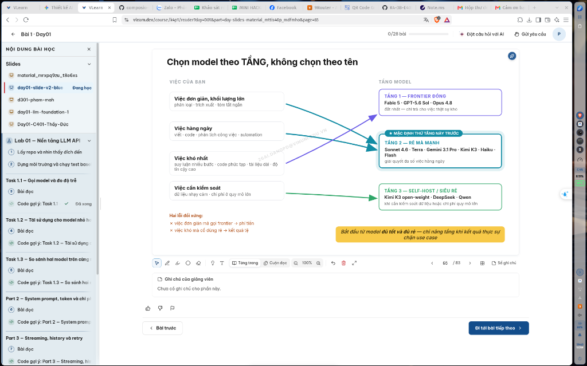

# Sơ Đồ Luồng Hoạt Động & Kiến Trúc Sản Phẩm (CP2)

**Khóa học:** VinUni AI20k · Mini Hackathon AI (Batch 04 · Lớp 3B · Phòng E403)  
**Nhóm dự thi:** BDKT (Đội trưởng: Phùng Đức Đăng - 2A202602956)  
**Đề tài (Track A · Đề A1):** VLearn AI Tutor — Trợ lý học tập bám sát bài giảng & Cơ chế xác thực nguồn 2 tầng (RAG nội bộ + Web Search có Disclaimer & Human-in-the-loop).

---

## 📌 LƯU Ý QUAN TRỌNG DÀNH CHO NGƯỜI ĐỌC (NON-TECH CLARIFICATION)

> [!IMPORTANT]
> **ĐÂY LÀ HỆ THỐNG GIA SƯ AI TRỢ GIẢNG (AI TUTOR), KHÔNG PHẢI LÀ CÔNG CỤ CHỌN MÔ HÌNH!**
>
> 1. **Vấn đề thực tế của học viên:** Khi đang tự học slide bài giảng trên nền tảng VLearn, học viên thường bắt gặp các **từ khóa chuyên môn khó hiểu hoặc khái niệm mới** mà tài liệu slide chỉ tóm tắt ngắn gọn.
> 2. **Hành vi bôi đen từ khóa để hỏi bài:** Thay vì phải copy từ khóa đó ra ngoài tìm kiếm trên Google (vừa tốn 10–15 phút, vừa dễ đọc phải tài liệu trôi nổi trên mạng gây lệch barem chấm thi), học viên chỉ cần:
>    * **Bôi đen trực tiếp từ khóa khó ngay trên trang slide** (hoặc bấm nút `+ Đặt câu hỏi với AI` trên thanh công cụ).
> 3. **AI Tutor giải quyết thế nào:** Trợ lý AI sẽ mở khung trò chuyện ở góc phải màn hình, tự động nhận diện học viên đang thắc mắc về từ khóa ở trang slide nào để giải thích cặn kẽ bám sát giáo trình, trích dẫn đúng số trang và mã bài giảng để học viên ôn thi và làm quiz chính xác nhất.
> *(Slide trang 65 "Chọn model theo TẦNG" được dùng trong tài liệu này là **ví dụ minh họa thực tế** của bài học Day 1 trên VLearn, không phải bản thân sản phẩm là bộ chọn mô hình).*

---

## 🖼️ 1. Giao Diện Thực Tế Nền Tảng VLearn Reader & Vị Trí Tích Hợp AI Tutor

Dưới đây là ảnh chụp màn hình giao diện thực tế của hệ thống học tập VLearn (`vlearn.dev/course/k4p1/reader`):



* **Vị trí 1 (Thanh Topbar phía trên):** Nút bấm `+ Đặt câu hỏi với AI` có biểu tượng lấp lánh (sparkle ✨), cho phép học viên chủ động mở khung chat trợ lý bất kỳ lúc nào.
* **Vị trí 2 (Trình đọc Slide trung tâm):** Nơi học viên đọc bài giảng (trong ảnh là Slide 65 của Day 1). Học viên có thể **bôi đen bất kỳ cụm từ khóa nào** để kích hoạt menu hỏi bài nhanh.
* **Vị trí 3 (Góc phải màn hình - Điểm đổi mới):** Khung chat **AI Tutor Right Drawer** (rộng 460px) sẽ trượt mượt mà từ cạnh phải màn hình sang, giữ nguyên trang slide bên trái để học viên vừa đọc vừa trao đổi với gia sư AI.

---

## 🧭 2. Sơ Đồ Luồng Xử Lý 4 Tác Nhân (Archify Workflow Diagram)

Sơ đồ dưới đây mô tả chi tiết quy trình xử lý 2 tầng nguồn (RAG nội bộ $
ightarrow$ Tra cứu ngoài có Disclaimer $
ightarrow$ Cổng thẩm định Giảng viên) phân theo **4 Tác nhân (4 Actors)**:


### 👥 Phân vai 4 Tác nhân (4 Actors / Swimlanes):

| Tác nhân (Actor) | Vai trò trong hệ thống | Vị trí giao diện tương ứng trên VLearn |
|---|---|---|
| **1. Học viên (Student)** | Người học đang tự học trên VLearn Reader, bôi đen từ khóa khó hoặc bấm `+ Đặt câu hỏi với AI` để hỏi bài. Nhận câu trả lời kèm nhãn xác thực hoặc phản hồi khi AI hỏi lại. | Màn hình chính `vlearn.dev/course/k4p1/reader`, Trình đọc slide và Khung chat Right Drawer. |
| **2. AI Tutor Engine (RAG & Router)** | Bộ điều phối trung tâm: tiếp nhận câu hỏi, tự động neo ngữ cảnh trang slide học viên đang xem, kiểm tra Guardrail chống gian lận, đối chiếu RAG nội bộ và phân loại tự tin theo mô hình 3 Dải Ngưỡng Thích Ứng (CRAG Evaluator). | Khung trò chuyện Right Drawer và Bộ điều phối RAG backend. |
| **3. Agent Tra Cứu (External Search Agent)** | Kích hoạt khi bài giảng chưa đề cập (< $eta$). Tra cứu web mở rộng trên **Whitelist học thuật có kiểm soát** (arXiv, tài liệu kỹ thuật chính thức), sinh câu trả lời kèm **Badge Vàng Cảnh Báo (Disclaimer)** và tự động đẩy vào Hàng đợi duyệt. | Agent tra cứu phụ trợ ngầm. |
| **4. Giảng viên / Trợ giảng (Reviewer)** | Giữ quyền kiểm soát cao nhất (Human-in-the-loop). Nhận thông báo trên Hàng đợi duyệt (`vlearn.dev/teacher/review`), thẩm định kiến thức ngoài bài và phê duyệt nạp vào Vector DB chung của cả lớp (Data Flywheel). | Giao diện quản trị duyệt bài của giảng viên / TA. |

---

## 🔀 3. Sơ Đồ Luồng Logic Chi Tiết (Mermaid Flowchart)

```mermaid
flowchart TD
    subgraph S1["1. HỌC VIÊN (VLearn Reader)"]
        A[Đang học bài giảng trên VLearn<br><i>Ví dụ: Đang mở Slide Day 1 hoặc Day 3</i>] --> B{Gặp thuật ngữ / khái niệm bài học chưa hiểu sâu}
        B -->|Thao tác 1| B1[Bấm nút '+ Đặt câu hỏi với AI'<br>trên thanh Topbar]
        B -->|Thao tác 2| B2[Bôi đen trực tiếp từ khóa khó<br>ngay trên trang slide]
        B1 --> C[Mở AI Tutor Right Drawer bên phải<br>Tự động neo ngữ cảnh bài học & trang slide hiện tại]
        B2 --> C
    end

    subgraph S2["2. AI TUTOR ENGINE (Bộ Điều Phối RAG Phân Cấp & Router)"]
        C --> D[Kiểm tra Ý định & Guardrail An Toàn]
        D -->|Hỏi giải hộ bài Lab / Gian lận| D_Reject[Từ chối giải bài hộ<br>Đưa ra gợi ý phương pháp debug sư phạm<br><i>HAX G10</i>]
        
        D -->|Hỏi khái niệm bài học| E1[Vòng 1 - RAG Cục bộ:<br>Tra cứu Vector DB của Bài học hiện tại]
        
        E1 --> F1{Điểm tự tin Vòng 1<br>có đạt chuẩn?}
        
        %% Nhánh 1a: Trúng bài hiện tại
        F1 -->|>= alpha_local: Trúng bài hiện tại| G1[Sinh câu trả lời bám sát giáo trình<br>Gắn Badge Xanh: <b>TRONG BÀI GIẢNG · SLIDE HIỆN TẠI</b><br>Nút: <i>Highlight đoạn trên slide</i>]
        
        %% Mở rộng Cross-Lecture sang Vòng 2
        F1 -->|< alpha_local: Chưa thấy trong bài này| E2[Vòng 2 - Mở rộng toàn khóa học:<br>Truy vấn Global Course Corpus (Day 01 - Day 15)<br><i>Tránh False Alarm ra ngoài mạng!</i>]
        
        E2 --> F2{Phân loại tự tin CRAG<br>trên Toàn Khóa Học}
        
        %% Nhánh 1b: Trúng bài khác trong khóa
        F2 -->|>= alpha_global: Trúng bài học khác trong khóa| G2[Sinh câu trả lời định hướng liên bài<br>Gắn Badge Xanh Lam: <b>THUỘC GIÁO TRÌNH · BÀI DAY 01 (TRANG 12)</b><br>Nút: <i>[👉 Chuyển đến Slide Day 1 Trang 12]</i>]
        
        %% Nhánh 2: Mơ hồ
        F2 -->|beta <= Điểm < alpha: Mơ hồ vùng xám| H[Kích hoạt <b>HAX G10 Clarification</b><br>Không đoán bừa, hỏi lại 1 câu thu hẹp phạm vi<br>Hiển thị 2 Chips lựa chọn nhanh]
    end

    H -.->|Học viên bấm chọn Chip phạm vi| E1

    subgraph S3["3. AGENT TRA CỨU (External Tool Calling)"]
        %% Nhánh 3: Ngoài toàn bộ khóa học
        F2 -->|< beta: Toàn bộ 15 buổi đều chưa dạy| I[Kích hoạt Tool Calling tra cứu Web ngoài<br>Chỉ tìm kiếm trên Whitelist: arXiv / Docs chuẩn]
        I --> J[Sinh câu trả lời kèm link tài liệu gốc<br>Gắn Badge Vàng Nổi Bật: <b>THAM KHẢO NGOÀI — CHƯA ĐƯỢC GIẢNG VIÊN DUYỆT</b><br>Cảnh báo nguy cơ lệch barem làm quiz]
        J --> K[Tự động đẩy vào Hàng Đợi Duyệt - Review Queue]
    end

    subgraph S4["4. GIẢNG VIÊN / TRỢ GIẢNG (Human-in-the-Loop)"]
        K --> L[Dashboard Hàng Đợi Duyệt của Giảng viên / TA]
        L --> M{Giảng viên / TA thẩm định nội dung}
        M -->|Nội dung sai / Lệch chuẩn| M_Drop[Bác bỏ / Gắn cờ cảnh báo không nạp]
        M -->|Nội dung chuẩn xác| N[Bấm: <b>Duyệt & Nạp vào Vector DB</b><br>Badge câu trả lời đổi thành: <b>ĐÃ ĐƯỢC GIẢNG VIÊN XÁC THỰC</b><br>Data Flywheel: Toàn bộ lớp được học bằng nguồn chuẩn]
    end

    G1 --> EndUser([Học viên hiểu bài chuẩn xác & tự tin làm đúng Quiz])
    G2 --> EndUser
    J --> EndUser
    N --> EndUser
```

---

## 🧪 4. Bốn Đường Đi Trải Nghiệm Cụ Thể (Khối Rubric R3)

| Đường đi | Tình huống học viên hỏi trên Slide 65 | Phản hồi của AI Tutor trong Right Drawer | Vị trí kiểm chứng trên Prototype |
|---|---|---|---|
| **1a. Happy Path (Bài hiện tại)** | Học viên hỏi: *"Khi nào tôi nên chọn Tầng 2 thay vì Tầng 1 theo quy ước của bài học?"* | RAG nội bộ trích đúng Slide 65, giải thích Tầng 2 ("Rẻ mà mạnh") là tầng mặc định thử trước cho việc hàng ngày. Gắn Badge Xanh `✅ ĐÃ XÁC THỰC TRONG BÀI GIẢNG · SLIDE TRANG 65` kèm nút bấm highlight ô Tầng 2 trên slide. | Tab 1: **"1. Trong bài"** |
| **1b. Cross-Lecture Path (Bài khác trong khóa)** | Học viên đang ở Day 3 hỏi: *"Khái niệm này có liên quan gì đến Next-Token Prediction ở Day 1 không?"* | RAG mở rộng toàn khóa học (Global Course Corpus), tìm thấy định nghĩa ở Day 1. Trả lời cô đọng và gắn Badge Xanh Lam: `📘 THUỘC GIÁO TRÌNH KHÓA HỌC · BÀI DAY 01 (TRANG 12)` kèm nút bấm `[🔗 Nhảy tới Slide Day 01]`, không nhảy ra ngoài web search. | Tab 5: **"5. Bài khác (Cross-Day)"** |
| **2. Low-Confidence** *(Lớp chỗ khó ②)* | Học viên hỏi câu ngắn, đa nghĩa: *"DeepSeek có dùng được không?"* | AI áp dụng **HAX G10**, không đoán bừa. Phản hồi: *"DeepSeek xuất hiện ở cả mục Self-host bảo mật và thảo luận API ngoài bài giảng. Để đối chiếu chuẩn nhất với Slide trang 65, bạn đang muốn hỏi về khía cạnh nào?"* kèm 2 Chips bấm nhanh. | Tab 2: **"2. Mơ hồ (G10)"** |
| **3. Failure / No-Grounding** *(Lớp chỗ khó ①)* | Học viên hỏi khái niệm nâng cao chưa dạy: *"DeepSeek-V3 dùng kiến trúc Multi-Head Latent Attention (MLA) là gì và có trong bài không?"* | RAG phát hiện Slide Day 1 không có định nghĩa MLA (< $eta$). AI gọi tool search trên arXiv, trả lời kèm **Badge Vàng Cảnh Báo**: `⚠️ THAM KHẢO NGOÀI — CHƯA ĐƯỢC GIẢNG VIÊN XÁC THỰC` và lưu ý lệch barem quiz. Tự động chuyển vào Review Queue. | Tab 3: **"3. Ngoài bài"** |
| **4. Correction** *(Human-in-the-loop)* | Giảng viên/TA mở modal Review Queue để thẩm định câu trả lời về MLA. | Giảng viên bấm `[✅ Duyệt & Nạp vào Vector DB]`. Tri thức mới được nạp vào Vector DB bài học. Badge trong phiên chat của học viên tự động chuyển sang `🌟 ĐÃ XÁC THỰC BỞI GIẢNG VIÊN`. | Tab 4: **"4. TA Duyệt"** / Nút chuyển chế độ Giảng viên |

---

## 💻 5. Tham Chiếu Mã Nguồn & Hướng Dẫn Cách Mở Xem

Toàn bộ mã nguồn giao diện, sơ đồ tương tác và dữ liệu đã được lưu trữ trong thư mục `codebase/`:

```
codebase/
 ├── index.html                  # Bản mẫu tương tác (Interactive Clickable Prototype)
 ├── vlearn-workflow.html        # Sơ đồ luồng tương tác sinh bởi Archify Engine (100% tiếng Việt)
 ├── vlearn-tutor.workflow.json  # File đặc tả cấu trúc sơ đồ theo chuẩn Archify Schema v2
 ├── vlearn_actual_ui.png        # Ảnh chụp giao diện thực tế VLearn Reader (Độ nét cao)
 ├── vlearn-workflow.png         # Ảnh xuất chất lượng cao của sơ đồ luồng Archify (1600x887 PNG)
 └── vlearn-workflow.svg         # File vector SVG nguyên gốc của sơ đồ luồng
```

### 🚀 Cách mở và trải nghiệm:

#### Cách 1: Mở Bản Mẫu Tương Tác VLearn (`codebase/index.html`)
* **Cách mở trực tiếp:** Nhấp đúp chuột vào file [codebase/index.html](./codebase/index.html) hoặc kéo thả file vào trình duyệt web (Chrome, Edge, Firefox, Brave).
* **Đường dẫn local:** `file:///mnt/win_d/VinUni/Hackathon/K4-3B-E403-BDKT/codebase/index.html`
* **Cách mở qua máy chủ mini (nếu muốn chia sẻ mạng nội bộ):**
  ```bash
  cd codebase
  python3 -m http.server 8080
  ```
  Sau đó mở trình duyệt truy cập: `http://localhost:8080`
* **Trải nghiệm trên giao diện:**
  * Bấm nút `+ Đặt câu hỏi với AI` hoặc icon AI trên slide để đóng/mở AI Tutor Right Drawer.
  * Bấm thử qua 4 tabs: `1. Trong bài`, `2. Mơ hồ (G10)`, `3. Ngoài bài`, `4. TA Duyệt` để xem AI xử lý từng trường hợp.
  * Bấm nút `Giảng viên/TA` trên thanh Topbar để mở Hàng đợi thẩm định và thử tính năng bấm Duyệt & Nạp tri thức.

#### Cách 2: Mở Sơ Đồ Luồng Tương Tác Archify (`codebase/vlearn-workflow.html`)
* **Cách mở:** Nhấp đúp chuột vào file [codebase/vlearn-workflow.html](./codebase/vlearn-workflow.html) hoặc mở trên trình duyệt:
  `file:///mnt/win_d/VinUni/Hackathon/K4-3B-E403-BDKT/codebase/vlearn-workflow.html`
* **Tính năng tương tác:**
  * Hỗ trợ chuyển đổi giao diện **Sáng / Tối**.
  * Bấm nút **Kịch bản trải nghiệm** để xem tiêu điểm (focus) từng luồng nghiệp vụ.
  * Bật chế độ **Chuyển động (Live trace)** để xem luồng dữ liệu chạy qua các hộp xử lý.
  * Xuất ảnh sơ đồ độ nét cao ra PNG, JPEG hoặc vector SVG qua menu **Xuất ảnh / SVG**.

---

### 🔗 Liên kết kiểm chứng mã nguồn trực tuyến (GitHub):
* **Repository:** [https://github.com/dawnmoriaty/K4-3B-E403-BDKT](https://github.com/dawnmoriaty/K4-3B-E403-BDKT)
* **Thư mục Codebase:** [https://github.com/dawnmoriaty/K4-3B-E403-BDKT/tree/main/codebase](https://github.com/dawnmoriaty/K4-3B-E403-BDKT/tree/main/codebase)
